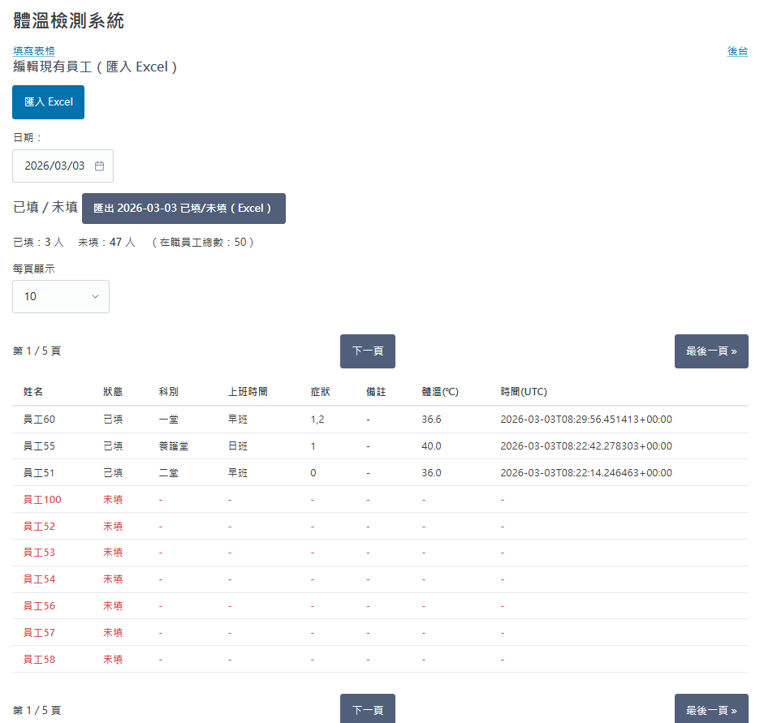

# 體溫檢測網站 v5（重新架構）

## 檔案
- templates/base.html：共用樣式/導覽
- templates/index.html：填寫表格（同樣式）
- templates/admin.html：
  1) 編輯員工名單 + 彈出視窗匯入 Excel（欄位標題：員工名字）  
  2) 今日已填/未填員工表格 + 匯出 Excel

## 後台匯出
- /admin/audit.xlsx：匯出今日已填/未填（Excel）

## Screenshot

### Temperature Form


### Admin Dashboard


## 啟動
```bash
pip install -r requirements.txt
cp .env.example .env
python app.py
```
## Docker
```bash
docker build -t temp-site .
docker run -d --name temp-site -p 8000:8000 -e SECRET_KEY=change-me -e BASIC_AUTH_USER=admin -e BASIC_AUTH_PASS=change-me -v ${PWD}/instance:/app/instance --restart unless-stopped temp-site
```